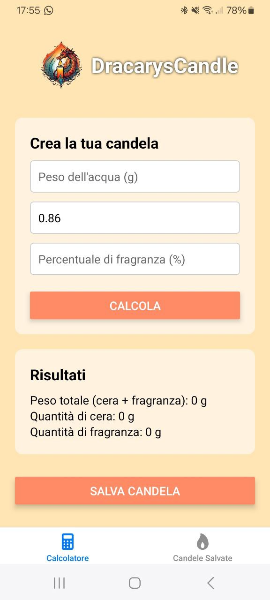
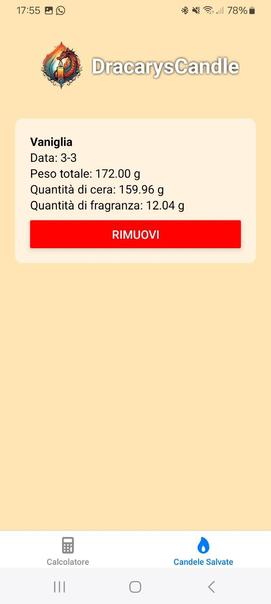

🕯️ #DracarysCandle

DracarysCandle is the perfect app for candle-making enthusiasts! 🏺✨ It helps you calculate the right amounts of wax, fragrance, and other ingredients to create perfect homemade candles. Plus, you can save your candle recipes as reminders for future projects. 📜🔥

📸 Screenshots

    
    

🎯 Features

✅ Ingredient Calculator – Enter the water weight and fragrance percentage to get the exact amount of wax and fragrance needed.
✅ Save Your Candles – Store your candles with name, date, and ingredient details.
✅ Recipe Management – Quickly access saved candle formulas and delete them when no longer needed.
✅ User-Friendly Interface – A clean and simple design that makes calculations and candle management effortless.

📲 How to Use

1. Open the app and enter the water weight for your candle.
2. Set the fragrance percentage to determine the exact amount needed.
3. Tap "Calculate" to get the total wax and fragrance weight.
4. Save your candle if you want to reuse the formula later.
5. Manage your saved candles in the dedicated section, with the option to remove them.
